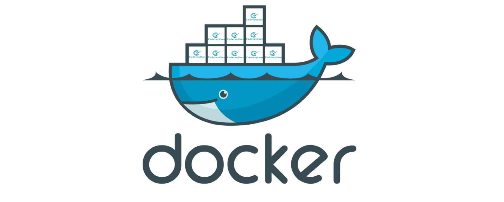

Hi 👋 I'm Steve,
============================

I create solutions from coding.
------------------------------

Software Engineer, Data Analyst, Blogger, Game developer, mentorship on best practices and peer code reviews. Indie Hacker whenever possible. Bootstrapped.

* 🌍  I'm based in Nairobi, Kenya.
* 🖥️  See my portfolio at [Website](https://www.linkedin.com/in/stephen-gashoka-software-engineer/)
* ✉️   You can contact me at [stephengachoka57@gmail.com](mailto:stephengachoka57@gmail.com)
* 📖  Read my Recent Articles [Dev](https://dev.to/stevehoober254)
* 🚀  I'm currently working on [ENORM.IO](https://github.com/stevehoober254/enorm.io)
       ***Enorm helps you create mailing lists from the subscriber form in your website and be able to use it in gmail as well as using it for your      compaigns***

------------------------------

### Let's connect Here 👇🏾

[LinkedIn](https://www.linkedin.com/in/WilsonKinyua/) |
[Website](https://developerwilson.com/) |
[Twitter](https://twitter.com/_wilsonkinyua) |
[Twitch](https://www.twitch.tv/stevehoober254) |
[Instagram]() |
[Facebook]() |
[Youtube]() |
[Google Play](https://play.google.com/store/apps/dev?id=4675069414572311917)

 

### I'm also into 👇🏾
* Machine Learning & AI | Web Development | SEO | APIs | DevOps | MLOps | Robotics | Internet of Things (**IoT**)

 

*************

 

### - Languages and Tools...

<!-- For more icons please follow  https://github.com/MikeCodesDotNET/ColoredBadges -->

     

 

